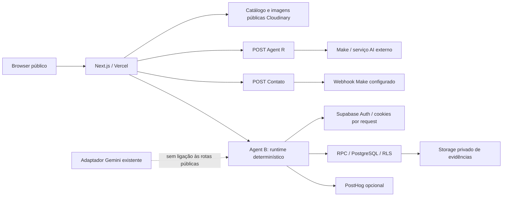

# Portfolio Security Assessment v1

VS Method™ — Post LOT-13 — Full-Stack & AI Agents Security Review  
Data: 08/10/2026, America/Sao_Paulo. Estado: auditoria concluída com recomendações; correções não autorizadas nem implementadas.

## 1. Executive Summary

O portfólio tem controles úteis de isolamento, autenticação, ownership, validação e falha fechada, particularmente no Agent B. Não foi demonstrado acesso entre usuários, execução de ferramentas pelo agente, XSS ou vazamento de segredo. Isso não constitui certificação de segurança: não houve exploração ativa, teste de carga nem acesso administrativo à configuração de produção.

A prioridade é tratar as dependências de runtime sinalizadas e confirmar as mitigações efetivas da Vercel. O lockfile contém Next.js 16.2.7 e sharp 0.34.5, versões alcançadas por advisories publicados. O npm audit retornou 14 pacotes sinalizados: 1 critical, 12 high, 1 moderate. A consulta separada `npm audit --omit=dev` retornou seis: 1 critical, 4 high, 1 moderate. Esses números são do scanner, incluem cadeias transitivas, e **não representam 14 vulnerabilidades exploráveis confirmadas no portfólio**.

O registro contextualizado deste assessment contém 12 achados de vulnerabilidade de dependência, ausência de defesa ou melhoria preventiva:

| Severidade do assessment | Quantidade |
|---|---:|
| CRITICAL | 0 |
| HIGH | 1 |
| MEDIUM | 4 |
| LOW | 6 |
| INFO | 1 |
| Total | 12 |

| Prioridade sugerida | Quantidade |
|---|---:|
| P0 | 1 |
| P1 | 2 |
| P2 | 8 |
| P3 | 1 |

P0 significa triagem imediata do risco de dependência e decisão humana sobre patch; não significa comprometimento observado ou autorização de deploy. Nenhuma vulnerabilidade crítica de exploração demonstrada foi atribuída ao produto. O risco financeiro/operacional de abuso dos endpoints e a ausência de cabeçalhos defensivos vêm em seguida. Não há justificativa para reescrever integralmente a aplicação.

## 2. Scope & Methodology

Baseline remoto após `git fetch origin`: **ed70452f52a04c6678bcf14e69869b2e368984fb**, `origin/main`, merge do PR #41. O painel público da Vercel confirma Production / Ready / Latest, domínio `victor-sizino.vercel.app`, deployment `dpl_3puYoCpsjF5mjbgfD9Z7atSnndxq` e esse mesmo SHA. [Deployment](https://vercel.com/victorvsp-8899s-projects/portfolio-victor-sizino/3puYoCpsjF5mjbgfD9Z7atSnndxq).

A branch local permanece `codex/lot-13-mold3-catalog-release`, HEAD `82c37b45806c8fbb42d0e62cb4f36f22ba9522d7`. `git diff HEAD origin/main --name-only` estava vazio: árvores iguais; diferença somente de histórico/merge. Portanto o código local lido representa exatamente a árvore da main atualizada, sem incorporar trabalho histórico de outros LOTs. Não foi necessário checkout nem criação de branch.

Métodos: inventário de rotas; leitura de páginas, contratos, adapters, aplicação e migrations; busca de sinks de HTML, execução dinâmica, credenciais e chamadas externas; npm audit sem instalação/fix; testes locais; GETs públicos de baixo volume; leitura de headers e bundles públicos; inspeção de histórico textual com saída redigida. Todos os testes de provedores usam mocks. A suite completa executada retornou **456/456 PASS**, sem skips. Testes estáticos e modelos de contrato SQL não equivalem a executar RLS/PostgreSQL de produção.

O único arquivo versionável criado por esta rodada é este relatório. Evidências auxiliares ficam fora do repositório, em `C:/Users/victo/.codex/visualizations/2026/10/07/01a11819-3c00-74b3-9e52-d9b648eeac5d/portfolio-security/`: `npm-audit.json`, `npm-audit-runtime.json` e `inspection-results.json`. Scripts temporários de inspeção foram removidos após uso. Não foram enviados prompts, dados pessoais, POSTs ou uploads aos agentes em produção; não houve fuzzing, bypass, enumeração sensível, carga, commit, push, PR, merge, deploy ou rollback.

## 3. Architecture & Attack Surface

| Endpoint | Método exportado | Autenticação / autoridade | Entrada e efeitos |
|---|---|---|---|
| `/api/agente-r` | POST | Público, sem auth da aplicação | Pergunta ≤1000 caracteres; corpo ≤4096 bytes; webhook fixo em env |
| `/api/contact` | POST | Público, sem auth da aplicação | Dados de contato; mensagem ≤2000 caracteres; corpo nominal ≤8192 bytes; webhook |
| `/api/agent-b/initialize` | POST | Supabase; pode criar identidade anônima se nova Discovery | UUIDs e timestamp; cria root/runtime/sessão, ou reabre handle autorizado |
| `/api/agent-b/orchestrate` | POST | Identidade autenticada e OWNER da Discovery | Corpo ≤16384 bytes; mensagem ≤2000 caracteres; lê contexto, captura declarações não verificadas |
| `/api/agent-b/continuity` | POST | Identidade autenticada e ownership | Corpo ≤2048 bytes; seleção de Discovery/retomada atomicamente autorizada |
| `/api/agent-b/identity/email/request` | POST | Sessão e OWNER; upgrade de identidade | Email; pode acionar entrega OTP pelo Supabase |
| `/api/agent-b/identity/email/verify` | POST | Sessão e OWNER; mesma identidade antes/depois | Email e código numérico; `email_change`, verificação confiável pelo provedor |
| `/api/agent-b/identity/email/status` | POST | Sessão e OWNER | Consulta estado verificado pelo provedor |

GET público nos oito endpoints retornou **405**; não há handler customizado GET. Next.js trata métodos não exportados. HTML público retornou 200. Não foram exercitados métodos de mutação em produção.

Além das oito rotas, a API Supabase é uma fronteira relevante: usuários podem obter sessões anônimas e a chave publishable não é segredo. Migrations concedem EXECUTE de RPCs a `authenticated`; controles devem funcionar mesmo fora do proxy Next.js. O `service_role` não é usado no caminho público examinado.

Outras integrações: WhatsApp por URL pública com texto codificado; Cal.com por link/iframe configurado; PostHog opcional; Resend em helper legado `lib/email.ts`, sem import encontrado no fluxo de contato ativo; Cloudinary somente delivery de imagens no runtime Mold3. Adapters de Evidence, MC-02 e Governance existem, mas não há endpoints HTTP públicos de upload, validação humana ou handoff nesta baseline. Sua superfície RPC/Storage continua relevante se as migrations estiverem aplicadas.

## 4. What Is Working Well

**What Is Working Well — Existing Security Strengths**

- **Identidade verificada pelo servidor:** `lib/agent-b/infrastructure/supabase/identity.server.ts:23–34` usa `auth.getUser()`, não aceita claims de `user_metadata`. Upgrade revalida ID e email; limpa sessão se OTP resultar em outra identidade (`:50–89`). Reduz troca de conta e confiança em tokens fornecidos pelo cliente.
- **Autorização de recurso em camadas:** `application/discovery-foundation.ts:25–40` exige root e access OWNER vinculados ao ator. `supabase/migrations/20260922000700_agent_b_reconciliation.sql:192–200` repete identidade, role e ownership na transação. RLS restringe leitura; o dono de uma Discovery não recebe automaticamente Human Governance.
- **Decisões humanas possuem autoridade separada:** migration 007, `:133–168` e `:231–268`, exige registro de autoridade ativa e decisão persistida correspondente. Não depende apenas de um boolean enviado pelo browser. Provisionamento real da autoridade em produção não foi auditado.
- **Cookies e cache adequados:** client Supabase por request, cookies HttpOnly/Secure/SameSite=Lax, fetch `no-store` (`client.server.ts:9–15`); respostas Agent B `private, no-store`, com cookies e headers do SDK propagados (`product-route.server.ts:18–23`). Evita cache público de respostas de identidade.
- **CSRF do Agent B e payload streaming:** `transport/product.ts:7–20` rejeita Origin divergente e Sec-Fetch-Site cross-site, exige JSON e interrompe leitura ao ultrapassar limite. Dois testes locais sintéticos de origem rejeitada confirmam o guard. Isso não é rate limiting.
- **Concorrência e replay:** migrations 007/011 usam locks, expectedVersion, ledgers e comparação da requisição de replay. `product-runtime.ts:113–124` revalida sessão/runtime antes de produzir ação. Erro de concorrência retorna contrato controlado.
- **Declaração não vira aprovação:** `information-capture.ts:48–54` gera informação UNVERIFIED, sem evidência e com pipeline pendente. Migration 011, `:138–160`, repete limites semânticos: não promove confidence, Human Confirmation ou Operational Approval. RPCs legados de create/update foram revogados em `:207`.
- **Ausência de executor livre de AI no Agent B público:** runtime e projeção são determinísticos, com schemas estritos e respostas limitadas. Não foi encontrado tool runner, `eval`, `new Function`, shell ou HTML arbitrário no caminho de produção. Source evidence não é automaticamente instrução executável.
- **XSS reduzido pela renderização textual:** Agent R renderiza cada linha em `
{line}
` (`AgentRSection.tsx:167–169`); Mold3 renderiza descrições como texto React (`ProductDetail.tsx:27`). A busca não encontrou `dangerouslySetInnerHTML` ou `innerHTML` em código da aplicação. Isso não prova ausência de todas as classes de XSS.
- **Agent R tem limites reais:** payload lido em streaming, resposta upstream limitada a 8KiB, timeout de 1–30s, contrato de answer e controle de caracteres (`app/api/agente-r/route.ts:55–126, 188–245`). Erros e logs não reproduzem pergunta, webhook ou resposta interna.
- **Storage de Evidence privado e imutável no SQL final:** bucket privado de 10MiB/MIME allowlist (migration 004); migration 007, `:287–310`, remove a policy inicial ampla, separa read/insert e só permite limpar objetos não registrados. Não foi incorretamente classificada a policy histórica substituída como vulnerabilidade atual.
- **Delivery e transporte:** allowlist HTTPS de Cloudinary restringe cloud/path e query vazia (`next.config.js:4–11`); WhatsApp usa `encodeURIComponent` e links abrem com noopener/noreferrer. HSTS foi observado em produção: `max-age=63072000; includeSubDomains; preload`.
- **Segredos:** chaves server-side e URLs webhook não são prefixadas NEXT_PUBLIC; Supabase publishable e PostHog project key têm função pública e não devem ser confundidos com service-role/API Secret. Escopo e resultados do scanner constam na seção 11.

## 5. Findings Register

Cada achado abaixo distingue evidência de código/configuração da exploração em produção. S/M/L são estimativas relativas, não cronograma contratado.

| ID | Componente | Severidade | Prioridade | Esforço | Confiança |
|---|---|---|---|---|---|
| SEC-01 | Next.js / sharp / runtime | HIGH | P0 | M | Alta para versão afetada; média para exposição |
| SEC-02 | Dependências de build/transitivas | MEDIUM | P2 | S | Alta para scanner; média para impacto |
| SEC-03 | Endpoints públicos e criação anônima | MEDIUM | P1 | M | Alta no código; média no risco residual |
| SEC-04 | Cabeçalhos HTTP / CSP / framing | MEDIUM | P1 | M | Alta |
| SEC-05 | RPCs Supabase / limites de recursos | MEDIUM | P2 | M | Alta no SQL; média em produção |
| SEC-06 | Buffer do corpo de contato | LOW | P2 | S | Alta |
| SEC-07 | Adaptador Gemini não conectado | LOW | P2 | S | Alta |
| SEC-08 | Estado conversacional do cliente | LOW | P2 | M | Alta para confiança; média para efeito |
| SEC-09 | Configuração de URLs externas | LOW | P2 | S | Alta |
| SEC-10 | Observabilidade Agent B / analytics | LOW | P2 | S | Alta |
| SEC-11 | Ranges e runtime de build | LOW | P2 | S | Alta |
| SEC-12 | Gates de segurança da entrega | INFO | P3 | S | Alta para ausência no repo |

### SEC-01 — Versões de runtime alcançadas por advisories

**Descrição/evidência:** `package-lock.json:5565–5566` contém Next.js 16.2.7; `:6322–6323` sharp 0.34.5. npm audit sinalizou `next` critical e `sharp` high. Advisories primários consultados: [RCE com AVIF no otimizador](https://github.com/advisories/GHSA-2xp9-vwfh-vxw4), [ImageResponse Node](https://github.com/advisories/GHSA-vcvr-r3jv-pc5j), [SSRF em Image Optimization](https://github.com/advisories/GHSA-cjq9-62q9-8jv4). Essas versões pertencem aos ranges afetados.

**Cenário/impacto:** processamento vulnerável de uma imagem controlada poderia comprometer confidencialidade/integridade ou disponibilidade se o caminho e as precondições do advisory estiverem presentes. **Não foi demonstrado exploit.** Não há `next/og`/ImageResponse com input hostil no código examinado, portanto aquele cenário específico não foi confirmado. O SSRF citado exige URL allowlisted controlada pelo atacante; só Cloudinary confiável está allowlisted. O advisory AVIF registra uma mitigação de desabilitação de AVIF, mas sua aplicação ao serviço Vercel efetivamente usado é NOT VERIFIED. PNGs aprovados não equivalem a prova de controle de todo o otimizador. O lockfile é evidência da dependência esperada; o artefato/versão efetivamente instalada pela Vercel não foi extraído de logs de build autenticados.

**Controle existente:** allowlist estreita; assets aprovados; Next Image gerenciado; não há uploader Cloudinary público no catálogo. **Recomendação:** triagem imediata, confirmar backend/mitigações do otimizador e Node.js em produção; preparar atualização compatível para release corrigido cobrindo todos os avisos aplicáveis (o scanner sugere next 16.4.0), com lockfile, review e QA. Não executar `npm audit fix --force` cegamente: o scanner também propõe downgrade de eslint-config-next. HIGH contextual, P0, M; confiança alta na presença, média na exploração possível.

### SEC-02 — Advisories transitivos e de build não tratados

**Descrição/evidência:** `npm-audit.json` sinaliza PostCSS, source-map-js, nanoid, js-yaml, browserslist, brace-expansion, braces, micromatch, fast-glob e cadeias ESLint. PostCSS top-level 8.5.15 em `package-lock.json:5941–5942`; também existe cópia transitiva no Next. Audit agrega pacotes, não ocorrências exploráveis independentes.

**Cenário/impacto:** código de build/lint processando conteúdo ou source maps não confiáveis pode sofrer DoS/leitura indevida conforme advisory; não há upload público de CSS/yaml/globs para esse tooling identificado. A exposição é maior em PR/build não confiável do que em um formulário de texto comum. A consulta runtime manteve baseline-browser-mapping, nanoid, next, postcss, sharp e source-map-js: presença na árvore de produção não implica que o caminho vulnerável processe entrada hostil durante requests. **Controle:** lockfile e conteúdo de build versionado; nenhum executor de tooling exposto por API. **Recomendação:** atualizar cadeias afetadas de forma compatível e repetir as duas consultas, distinguindo dev-only, build e request-time. Avaliar todo PR que altere source maps/configuração. MEDIUM, P2, S; confiança alta no scanner, média no caminho de ataque.

### SEC-03 — Ausência de proteção de abuso na aplicação

**Descrição/evidência:** `app/api/agente-r/route.ts:138–199` e `app/api/contact/route.ts:138–191` encaminham entradas válidas sem rate limit/captcha/quotas. `product-runtime.ts:42–51` pode criar identidade/Discovery; `identity.server.ts:37–43` usa signInAnonymously. `progressive-identity.ts:39–59` não acrescenta cooldown de OTP. Busca no caminho app/lib não encontrou limiter, Turnstile ou quota implementados.

**Cenário/impacto:** repetição de requests válidos pode consumir Make/AI, disparar contato/OTP, aumentar identidades, dados e custos; identidade anônima não prova que é uma pessoa. Não houve teste de carga. **Controle:** payloads limitados, timeouts, ownership e limites próprios dos provedores; WAF/quotas efetivas são NOT VERIFIED. **Recomendação:** um limiter compartilhado ou regras Vercel apropriadas, limites por identidade/IP e quotas por Discovery; desafio anti-bot apenas onde necessário; cooldown de OTP e alertas de consumo. Verificar proteção também no Supabase Auth, que pode ser acessado diretamente. MEDIUM, P1, M; alta no código/média no impacto residual.

### SEC-04 — CSP e proteção contra framing ausentes

**Descrição/evidência:** GET de `/`, `/mold3/catalog`, `/vs-method/agents/agent-b` não retornou CSP, CSP-Report-Only, X-Frame-Options, X-Content-Type-Options, Referrer-Policy ou Permissions-Policy. Rechecagem inclui `/contato`. `next.config.js` não define `headers()`; HSTS está presente. `inspection-results.json` preserva os headers examinados.

**Cenário/impacto:** ausência de frame-ancestors/XFO permite framing sem barreira declarada, favorecendo interface enganosa; ausência de CSP reduz defesa em profundidade se um futuro sink de XSS for introduzido. Não foi encontrado XSS ativo. **Controle:** escaping React, links seguros, HTTPS/HSTS. **Recomendação:** começar CSP em report-only com compatibilidade Next, imagens Cloudinary e Cal.com; depois aplicar frame-ancestors, nosniff e políticas proporcionais. Definir se alguma página deve legitimamente ser embutida. MEDIUM, P1, M, confiança alta.

### SEC-05 — Limites do Next não cobrem RPC direto

**Descrição/evidência:** migration 011, `:109–125`, valida estrutura e candidatos não vazios, mas não estabelece máximo geral de candidatos/bytes/texto de declaração nesse writer; `:139–160` limita semântica/estado, não volume. `:210` concede EXECUTE a authenticated. Migration 007 cria Discovery/session por RPC com ownership, porém sem quota por usuário. Bucket tem limite por arquivo, não quota acumulada de arquivos por identidade.

**Cenário/impacto:** dono autenticado, inclusive anônimo, pode usar a API Supabase diretamente e evitar o limite de 16KiB do proxy Next, persistindo mais dados/consumindo locks, Storage e recursos do que a UI sugere. Não foi demonstrado acesso a outra Discovery ou promoção a governança. **Controle:** auth.uid, OWNER, strict SQL, cardinalidade, CAS, authority ledger, limites da infraestrutura. **Recomendação:** limites de bytes/texto/candidatos e quotas cumulativas nos RPCs/Storage, ou política deliberada que restrinja chamadas diretas; manter invariantes de confiança em SQL. Confirmar migrations aplicadas antes de concluir sobre exposição real. MEDIUM, P2, M; alta no código/média em produção.

### SEC-06 — Contato aloca o corpo antes de medir bytes

**Descrição/evidência:** `app/api/contact/route.ts:147–159` consulta Content-Length, depois `request.text()` e só então mede 8192 bytes. Não segue o streaming limitado do Agent R/Agent B.

**Cenário/impacto:** corpo sem tamanho declarado é consumido integralmente antes da rejeição, aumentando memória/trabalho dentro dos limites de transporte da plataforma. Não se assume tamanho ilimitado na Vercel; limite efetivo é NOT VERIFIED. **Controle:** JSON, validação posterior, limite declarado e plataforma. **Recomendação:** reutilizar leitura streaming cancelável e limitada. LOW, P2, S, confiança alta.

### SEC-07 — Gemini carece de deadline e limite de saída antes da ativação

**Descrição/evidência:** `gemini.server.ts:10–12` não passa AbortSignal nem maxOutputTokens e chama response.json sem limite de bytes. Faz até duas tentativas, sem backoff. `core/ai.ts:5–8` limita contexto a 12000 caracteres e estrutura de candidates, mas isso ocorre antes/depois da chamada, não controla o transporte. Teste local com fetch mock confirmou ausência de signal e token cap.

**Cenário/impacto:** quando conectado, provedor lento/resposta grande pode consumir duração/memória/tokens; schema válido não garante que a decisão seja imune a prompt injection. Hoje esse adapter não é alcançável pelas oito rotas públicas. **Controle:** provider fixo, enum de operações, CandidateSchema, vinculação a discovery/version e retry limitado. **Recomendação:** deadline end-to-end, limite de resposta em bytes/tokens, cancelamento, backoff e budget; chave em header apropriado em vez de query quando suportado, para reduzir exposição em tracing. LOW para baseline atual, P2, S, alta. Reavaliar severidade antes de ativação.

### SEC-08 — Estado do browser influencia a agenda de captura

**Descrição/evidência:** `product-conversation.ts:10` recebe conversationalState desconhecido; `conversational-state.ts:25–55,91–95` valida forma e binding, sem assinatura/estado authoritative no servidor. `product-runtime.ts:61–67` usa nextAgendaTopicId desse estado como agendaTopicId na captura.

**Cenário/impacto:** usuário dono da sessão pode editar um estado estruturalmente válido para mudar o tópico/fluxo e influenciar classificação de sua declaração não verificada. Não concede ownership, aprovação ou acesso entre usuários; não é bypass confirmado de Human Governance. **Controle:** schemas, binding Discovery/session, limites de agenda, contexto confiável e publicação UNVERIFIED. **Recomendação:** documentar esse estado como sugestão não confiável; derivar tópico de estado servidor quando a integridade da classificação importar, ou autenticar o estado. LOW, P2, M; alta para fronteira/média para efeito semântico.

### SEC-09 — URLs de integração não possuem validação consistente

**Descrição/evidência:** Agent R `:182–198` e contato `:120–121,183–191` usam webhook de env sem validar protocolo/host e aceitam redirect padrão do fetch; `analytics.server.ts:2` concatena host configurado; `ScheduleEmbed.tsx:3,25–30` embute URL de env sem allowlist/sandbox/referrerPolicy. Supabase, em contraste, valida HTTPS e ausência de credenciais/query (`config.server.ts:6–12`).

**Cenário/impacto:** erro operacional ou configuração comprometida pode enviar perguntas/dados de contato a destino indevido, ou embutir site não aprovado. O atacante da API não controla essas URLs; **não é SSRF arbitrário demonstrado pelo usuário**. **Controle:** valores server-side/env e origem definida pela equipe. **Recomendação:** validação HTTPS/allowlist na inicialização; política explícita de redirects; validar Cal.com e permissões mínimas de iframe sem quebrar agenda. LOW, P2, S, alta.

### SEC-10 — Diagnóstico Agent B pouco correlacionado e analytics sem deadline

**Descrição/evidência:** `product-route.server.ts:41–47` só envia evento; `transport/product.ts:2–5` retorna código sem requestId. `analytics.server.ts:2` usa fetch sem timeout, suprime falha, e a rota chama com `void`. `application/correlation.ts` existe, mas não está ligado à route adapter pública. No painel público Vercel Web Analytics/Speed Insights aparecem Not Enabled; isso não prova ausência de logs do provedor.

**Cenário/impacto:** abuso/falhas simultâneas ficam difíceis de correlacionar; evento fire-and-forget pode não ser entregue e não deve ser controle de segurança. **Controle:** códigos fixos e ausência deliberada de conteúdo/PII no log; Agent R/contato já têm requestId. **Recomendação:** requestId e eventos estruturados com status/duração/código, sem textos, emails, tokens ou IDs completos de sessão; timeout curto para analytics; alertas básicos de erro/custo, sem plataforma complexa. LOW, P2, S, alta.

### SEC-11 — Ranges flutuantes e runtime de entrega não declarado

**Descrição/evidência:** `package.json:16–34` usa latest para Next/React/tooling; não declara engines/packageManager. Lockfile existe e fixa versões/integrities.

**Cenário/impacto:** regeneração do lock ou instalação sem lock pode variar significativamente e introduzir regressão/supply-chain drift; não há evidência de pacote malicioso ou dependência instalada sem lock. **Controle:** package-lock versionado e QA existente. **Recomendação:** versões/ranges deliberados, runtime Node suportado declarado, npm ci e atualização revisada; confirmar comando real da Vercel. LOW, P2, S, alta.

### SEC-12 — Gates contínuos de segurança não evidenciados no repositório

**Descrição/evidência:** ausência de `.github/workflows` e configuração Dependabot versionada no inventário; scripts incluem lint/typecheck/build/test, sem audit gate. GitHub registrou Vercel success, mas isso não comprova branch protection, secret scanning ou aprovação obrigatória.

**Cenário/impacto:** regressão/advisory novo pode alcançar release sem revisão de segurança automatizada. Checks externos e settings GitHub são NOT VERIFIED, não declarados inexistentes. **Controle:** revisão humana e suite local forte. **Recomendação:** CI mínima de qualidade + audit triado, atualização automatizada com review, secret scanning/push protection se disponível, permissões mínimas e proteção de main verificadas. INFO, P3, S, alta para ausência no repo.

## 6. Agent B™ Deep Security Assessment

### Caminho efetivamente executado

Routes Next → readProductInput → schemas físicos UUID → Supabase client por request → IdentityAdapter → ProductRuntime/ProductContinuity → ownership/sessão/runtime → GovernedContextResolver → GovernedOrchestration determinística → contrato público. Captura opcional gera candidatos pela lógica de Information Capture e publica informação UNVERIFIED via RPC. Nada permite que a mensagem do usuário execute shell, navegue para URL fornecida ou escolha ferramenta livre.

Novas Discoveries podem adquirir usuário Supabase anônimo; existentes exigem a identidade original (`product-runtime.ts:45–48`). Anonymous equivale a principal autenticado Supabase, não autorização humana. Leitura, continuidade e mutação repetem ownership; uma sessão OPEN por Discovery é imposta em índice parcial SQL. Sessões/versions fornecidas pelo cliente não são autoridade: a aplicação compara estado persistido e a transação faz CAS/replay. UUIDs/timestamps são validação estrutural; não são autenticação.

### Estado, persistência e governança

Migrations versionadas mostram RLS, grants restritos de escrita, search_path fixo nas funções definer, lock de owner, autoridade separada, decisões imutáveis e ledgers de operação. Aplicar a migration 011 é essencial: ela revoga writers legados e impede promoção indevida no writer público de informação. Policies de Storage atuais também dependem da migration 007, não da versão inicial isolada.

RPCs com publishable key e JWT authenticated formam uma interface adicional ao Next; o modelo deve suportar chamadas diretas. As principais lacunas são consumo/quotas (SEC-03/05), estado de agenda controlável (SEC-08) e observabilidade (SEC-10). Não se verificaram settings Auth, RLS live, grants live, sessão efetiva/cookies de usuário, migrations aplicadas nem revogação/provisionamento real de autoridade. Nenhuma decisão humana ou banco foi modificado para testar esses controles.

### AI, prompt injection e tool execution

O GeminiAiAdapter e GovernedAiFoundation são módulos existentes/testados, **não um LLM ativo atrás do endpoint orchestrate**. Runtime exposto não constrói prompt, não faz tool calling e não consome instruções de arquivos como autoridade executável. Evidências/declarações são dados e fontes; captura não transforma texto “aprovado” em Human Governance. Isso reduz fortemente a classe de prompt injection que leva a execução/ações.

Se Gemini for ativado: contexto atualmente concatenado no mesmo texto de instrução, sem um boundary robusto de trust; validação de shape/operation/discovery/version não prova resistência a injeção semântica, vazamento de instruções ou escolha errada de candidate. Deve haver minimização de contexto, separação explícita de fontes não confiáveis, teste sintético em ambiente isolado, ausência de segredo nos prompts e decisão autoritativa fora do modelo. Não foi alegada vulnerabilidade de prompt injection explorada em produção. Tool allowlist/human gate para ações futuras permanece requisito de design, não controle exercitado nesta baseline.

Limites implementados: request 2KiB/16KiB, mensagem 2000 caracteres, resposta de conversa 1200 caracteres, listas de agenda limitadas, AI context 12000 caracteres e candidates até 20. Deadline de 20s do cliente (`runtime-client.ts:11`) não cancela automaticamente RPCs ou trabalho server-side. Fetch Supabase não acrescenta timeout próprio (`client.server.ts:14`); duração/limites do SDK e Vercel são NOT VERIFIED. Retry Gemini até duas tentativas é existente; maxOutputTokens, deadline e bound de resposta são ausentes (SEC-07).

### Falha fechada

Falhas de auth/ownership/versão recusam; ausência/configuração inválida retorna indisponibilidade; exceptions não são serializadas ao browser. Produto não declara operacionalmente aprovado o conteúdo capturado. Testes unitários/modelos comprovam comportamento de código, não isolamento real do banco. Não houve teste de autenticação adversarial em produção.

## 7. Agent R™ & Integrations Assessment

Agent R é um relay público para URL Make configurada. Entrada estrita de uma chave question, limite de bytes streaming, normalização e timeout implementados. Resposta plain text/JSON answer é limitada e validada, sem executar markup. Não há auth/rate limiter, escopo de ferramenta ou assinatura adicional no outbound além de X-Request-Id. O webhook pode usar sua própria URL-capability; isso não prova autenticação forte do cenário Make.

Prompt do serviço externo, modelo OpenAI utilizado, base de conhecimento, permissões de ferramentas, credenciais, retries, budgets, sanitização secundária, retenção e segurança do cenário Make são **NOT VERIFIED**. Sanitizar whitespace não mitiga prompt injection. Não foram enviados prompts maliciosos ou consultas com dados reais. Só uma revisão do cenário/agent externo pode fechar essas conclusões; não inferir que o Agent R tem tools perigosas ou que nunca as tem.

Contato valida tipos/required/email/formato e remove caracteres de controle; não gera HTML nem SQL local. Campos extra são ignorados, não repassados em massa. body nominal 8KiB possui a limitação de buffer SEC-06. JSON-only sem CORS permissivo na API reduz requisições cross-site simples; ausência de Origin check não foi classificada como CSRF de sessão confirmado porque esses dois endpoints não fazem operações autenticadas por cookie. Adotar mesma política de origem do Agent B pode ser hardening adicional, sem substituir limiter.

Make recebe dados pessoais do formulário; retenção, acesso, escopo e ação final de email são NOT VERIFIED. Recomendação proporcional: verificar destino/retention, bloquear spam e revisar credentials/permissions do cenário. Resend helper é legado não alcançado pelo handler ativo; não se atribui efeito em produção só pela presença de RESEND_API_KEY no template.

Cloudinary: runtime Mold3 só inclui cloud name público e URLs de delivery aprovadas, sem API Key/Secret/Admin API/Collection. Allowlist não é por Public ID individual; administrador deve controlar quem publica no cloud. Settings de upload unsigned, restrictions, assets privados e credenciais Cloudinary são NOT VERIFIED. Não houve login Admin API ou upload/delete.

WhatsApp apenas constrói URL com nome de produto/texto codificado; public phone é contato comercial. Não há token de WhatsApp Business API no caminho. Cal.com usa iframe env/fallback público; validar host e minimização de permissões conforme SEC-09. PostHog recebe somente evento no caminho atual, sem propriedades de conteúdo ou gravação de sessão; delivery/consentimento/configuração externa não verificados.

## 8. Front-end & API Assessment

React/Next páginas e componentes examinados renderizam dados como texto/props, sem sink HTML perigoso ou eval encontrado. Não há query de banco montada por concatenação de texto do usuário na aplicação; Supabase usa RPCs e parâmetros tipados. SQL examinado usa funções com parâmetros e nomes qualificados, não EXECUTE de SQL fornecido pelo visitante.

URLs de navegação do catálogo usam slugs aprovados. Redirect `/cases/case-porto-seguro-setur` é fixo para rota local e não forma open redirect. Links externos do Mold3 usam noopener/noreferrer. `.env` controla iframe/webhooks; riscos são configuracionais, não usuário escolhendo endpoint. Image Optimization é uma superfície própria do framework; a análise de dependências não pode ser substituída por contar imagens que responderam 200.

APIs: métodos exportados POST; oito GETs retornaram 405. Agent B JSON/read streaming/Origin guard; Agent R JSON/streaming/response bound; contato JSON/validação/body buffering. Erros públicos não retornam stack trace ou payload upstream. CORS wildcard observado em HTML público, sem allow-origin nas respostas GET 405 das APIs; isso **não** demonstra CORS credenciado inseguro nos POSTs. Não foi verificada resposta autenticada cross-origin de produção.

Nenhum inbound webhook Next customizado foi encontrado; existem outbound webhooks Make. Não se recomenda validar uma assinatura inbound em uma rota que é realmente formulário público; autenticação servidor-servidor deve ser discutida para o destino Make.

## 9. Infrastructure & Supply Chain

Confirmados: main/SHA/deployment Ready, HTTPS/HSTS, remotePatterns, lockfile e scripts de qualidade. Next.js esperado pelo lock 16.2.7, React/React DOM 19.2.7, sharp 0.34.5, PostCSS 8.5.15, Supabase SSR 0.12.7/JS 2.117.0. Nenhuma dependência foi atualizada.

Audit distingue advisories não aplicáveis (ex. ImageResponse sem uso) de runtime com precondições relevantes (Image Optimization). No caso SSRF específico, Cloudinary confiável limita a condição atacante-controla-host. Não se pode converter o número critical do scanner em prova de RCE no deployment. Evidências e fontes em SEC-01/02; futura atualização deve tratar também cópias transitivas e fix suggestions incompatíveis.

Configuração de ambiente permanece server-side para chaves privadas; o template só declara nomes e não foi impresso com valores. `.env*.local` e `.vercel` são ignorados. `.env.production`/`.env` não estão explicitamente ignorados por esse padrão: ponto preventivo para uma futura política de secrets; nenhum desses arquivos foi encontrado versionado no inventário/histórico de nomes examinado. Não foi concedida autorização para editar gitignore nesta rodada.

Não há workflow de GitHub Actions versionado identificado. CI externa, tokens instalados, branch protection/rulesets, review obrigatório, token permissions, secret scanning, MFA de contas, deploy automático/ignored build step/pausas, preview authentication, variáveis separadas por ambiente, runtime Node real, WAF e quotas: NOT VERIFIED. Ausência no repositório não permite concluir ausência na conta/provedor. Nenhum teste privilegiado de settings foi tentado.

## 10. Security Improvement Roadmap

| Fase | Ação proporcional | Tipo | Gate de validação |
|---|---|---|---|
| P0 | Triar SEC-01 e confirmar mitigações/versões em produção; preparar patch compatível aprovado | Quick win com QA | Audit atualizado, lock review, testes/build, QA catálogo/Agent B; publicação só autorizada |
| P1 | Limiter/cooldown/quotas simples para AI, contato e Auth anônimo/OTP | Hardening localizado | Mocks de abuso/429, política de budgets e proteção direta Supabase confirmada |
| P1 | Headers defensivos e CSP report-only antes de enforcement | Quick win com compatibilidade | Sem quebra de Next, Cloudinary, Cal.com; frame policy definida |
| P2 | Atualizar tooling transitivo; congelar runtime/ranges e instalar por npm ci | Quick wins | Audit runtime/dev separado; build consistente |
| P2 | Streaming contato, validação de URLs, deadlines/telemetria seguros | Quick wins | Testes locais de cancelamento/size/origin/config; nenhum PII em logs |
| P2 | Quotas em RPC/Storage e estado de agenda confiável quando necessário | Estrutural localizada | Harness SQL local autorizado, ownership/RLS/replay/quotas, sem tocar produção |
| P2 | Antes de conectar Gemini: budgets e trust boundaries; revisão AI/Make | Gate de arquitetura | Cenários sintéticos de prompt injection em staging; sem ferramentas privilegiadas livres |
| P3 | CI mínima, atualização recorrente triada, secret protection/rulesets e runbook | Maturidade | Settings verificados; mínimos privilégios; alertas simples de erro/custo |

Evitar infraestrutura de segurança pesada para um portfólio pequeno. Usar primeiro capacidades do hosting/Auth já existentes, mantendo o dado durável protegido no banco. Um limiter no Next sozinho não cobre Auth/RPC direto. Não criar pipeline genérico de agentes ou reescrever domínio para resolver essas lacunas.

## 11. Risks, Assumptions & Unverified Controls

Estados utilizados: IMPLEMENTED/OBSERVED para controles no código/respostas; NOT VERIFIED para configuração/runtime administrativo; LATENT para adaptador não conectado. Campos “confiança” descrevem qualidade da evidência, não chance matemática de exploração.

Limites: sem credentials de painel, sem database/Auth/Storage live introspection, sem tentativa de bypass, sem teste de carga, sem execução SQL contra banco de produção, sem auditoria de cenários Make/OpenAI ou corpus privado do Agent R. O sucesso dos 456 testes é funcional/contratual, não pentest. Não se testaram malware/parsers complexos de documentos nem configurações de upload Cloudinary. `.next` local e ambiente local não são tratados como prova do runtime de produção.

Scanner de secrets compara valores sensíveis conhecidos do ambiente local e padrões selecionados de tokens/chaves, sem imprimir valores. Histórico: **631 blobs textuais** das refs Git alcançáveis localmente inspecionados, zero correspondências; **56 blobs binários e três acima de 2MB excluídos**. Objetos não alcançáveis também estão fora do escopo. Produção: **quatro HTMLs e 15 chunks client-side**, zero correspondências. Segredos arbitrários antigos, valores rotacionados sem padrão e configurações exclusivamente remotas podem não ser identificados. Resultados ficam em inspection-results.json; o scan não é garantia de inexistência de segredo. Não foram coletados dados privados de usuários.

Exigir evidência administrativa para: migrations 001–011 aplicadas e policies/grants atuais; bucket privado/MIME/size e anti-overwrite; Supabase Auth captcha/anonymous/OTP quotas/retention; isolamento de previews/produção; runtime/patch/mitigação image optimizer; WAF; secrets/least privilege/MFA; Make AI prompt/tool/access/budgets; logging e retenção. Não promover esses itens a PASS com base em documentação histórica.

## 12. Recommended Next Decisions

1. Aprovar triagem/patch de SEC-01 como primeira rodada de hardening, com base em advisory aplicável e confirmação de mitigação da Vercel, sem assumir comprometimento.
2. Definir budget e política simples de acesso/abuso para Agent R, contato e criação/upgrade anônimos do Agent B.
3. Autorizar verificação administrativa read-only dos controles NOT VERIFIED; indicar responsáveis por Vercel, Supabase, Make/AI, Cloudinary e GitHub, sem enviar credenciais no chat.
4. Aprovar rodada de headers/streaming/URLs e observabilidade com QA de compatibilidade.
5. Definir se Gemini será ativado e se a agenda client-side precisa de integridade server-side; exigir nova revisão antes de tools/LLM entrarem no runtime público.

## 13. Human Governance Gate

Entregue para revisão humana. **Nenhuma implementação está autorizada por este relatório.** Recomendações não constituem autorização para alterar código, configurações, migrations, credenciais, infraestrutura ou produção. Decisão de priorização e aceitação de risco pertence à Human Governance.

Próximo gate: revisar achados, confirmar controles externos e autorizar explicitamente a primeira rodada de hardening. Nenhum commit/push/PR/merge/deploy foi realizado.
